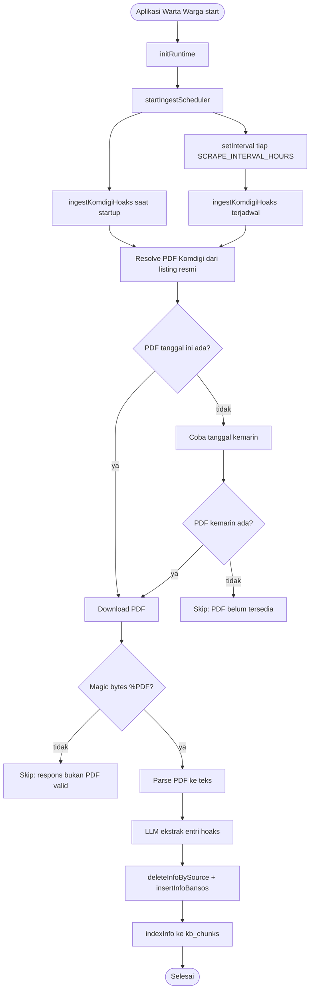
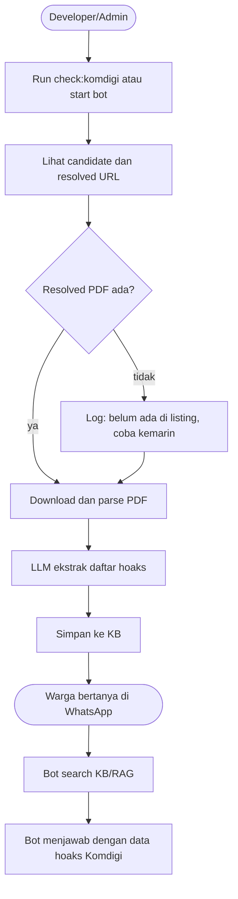

# Komdigi Hoaks Ingest Userflow

Dokumen ini merangkum alur ingest data hoaks harian Komdigi di Warta Warga, dari scheduler saat bot menyala sampai data masuk ke Knowledge Base.

## Tujuan

Pipeline Komdigi mengambil PDF "Isu Hoaks Harian" dari situs resmi TrustPositif Komdigi, mengekstrak daftar hoaks/disinformasi, lalu menyimpannya sebagai data nasional di Knowledge Base agar bisa dipakai bot untuk menjawab pertanyaan warga tentang hoaks.

Komponen utama:

| Komponen | File | Fungsi |
| --- | --- | --- |
| Entry point aplikasi | `src/index.js` | Init runtime, start ingest scheduler, dashboard, dan WhatsApp bot |
| Scheduler Agent 1 | `src/agent1/scheduler.js` | Menjalankan ingest Komdigi saat startup dan interval berkala |
| Ingest Komdigi | `src/agent1/komdigi.js` | Resolve PDF, download, parse, ekstrak dengan LLM, simpan ke KB |
| Manual check script | `scripts/check-komdigi.js` | Menjalankan ingest Komdigi sekali jalan untuk verifikasi |
| Storage | `src/db/index.js` | Menulis ke SQLite lokal atau Supabase Postgres |
| Vector index | `src/kb/vectorStore.js` | Membuat chunk dan embedding di `kb_chunks` |

## Userflow Tingkat Tinggi



## Trigger Pipeline

### 1. Saat aplikasi utama berjalan

`src/index.js` memanggil:

```js
startIngestScheduler();
```

Scheduler ini hidup setelah `initRuntime()` selesai, jadi database dan whitelist cache sudah siap.

### 2. Saat scheduler aktif

`src/agent1/scheduler.js` menjalankan:

- `ingestKomdigiHoaks()` saat bot start.
- `ingestKomdigiHoaks()` lagi di interval `SCRAPE_INTERVAL_HOURS`.
- `scrapeAllSources()` untuk sumber bansos tetap mengikuti config `SCRAPE_ON_BOOT` dan interval yang sama.

Catatan: Komdigi sengaja tetap di-ingest saat bot start karena PDF harian relatif kecil dan bukan crawl besar.

### 3. Manual check

Untuk menguji ingest tanpa menyalakan bot:

```bash
npm run check:komdigi
npm run check:komdigi -- --date 2026-06-29
npm run check:komdigi -- --date 2026-06-29 --json
```

Script ini:

1. Parse argumen `--date` dan `--json`.
2. Menampilkan candidate URL.
3. Resolve URL PDF aktual dari listing Komdigi.
4. Init DB.
5. Cek `OPENROUTER_API_KEY`.
6. Hitung total `info_bansos` sebelum ingest.
7. Jalankan `ingestKomdigiHoaks()`.
8. Hitung total `info_bansos` setelah ingest.
9. Mengembalikan summary dan exit code.

## Resolve PDF Komdigi

Pipeline tidak lagi menebak URL seperti:

```text
https://trustpositif.komdigi.go.id/pdfhoaks/Harian/2026-06-29.pdf
```

URL tersebut bisa membalas `HTTP 200` tetapi berisi HTML listing, bukan PDF valid.

Flow yang dipakai sekarang:

1. Buka listing resmi:

```text
https://trustpositif.komdigi.go.id/pdfhoaks/Harian
```

2. Parse semua link PDF dengan Cheerio.
3. Cocokkan label tanggal Indonesia, misalnya:

```text
29 Juni 2026
28 Juni 2026
```

4. Ambil link PDF asli dari folder asset, contohnya:

```text
https://trustpositif.komdigi.go.id/assets/hoaks_harian/28%20Juni%202026%20-%20Isu%20Hoaks%20Harian.pdf
```

5. Kalau tanggal hari ini belum ada, coba tanggal kemarin.

## Validasi Download

Setelah URL PDF ditemukan, pipeline download file dengan `axios` sebagai `arraybuffer`.

Respons dianggap valid hanya jika:

- HTTP status `200`
- ukuran file lebih dari 500 bytes
- 4 bytes pertama adalah `%PDF`

Jika server membalas HTML, halaman error, atau file non-PDF, pipeline tidak memanggil parser PDF dan akan log:

```text
[Komdigi] Respons bukan PDF valid ...
```

## Parse PDF

`src/agent1/komdigi.js` mendukung dua API `pdf-parse`:

- API lama: package langsung berupa function.
- API baru `pdf-parse@2.x`: memakai class `PDFParse`.

Untuk API baru, flow-nya:

```js
const parser = new pdfParse.PDFParse({ data: buffer });
const data = await parser.getText();
await parser.destroy?.();
```

Output parser adalah teks mentah dari PDF. Jika teks kosong atau terlalu pendek, ingest berhenti dengan error `empty_text`.

## Ekstraksi Dengan LLM

Teks PDF dipecah menjadi beberapa segment:

- `CHUNK_SIZE = 4500`
- `CHUNK_OVERLAP = 150`

Setiap segment dikirim ke LLM lewat `chatJson()` dengan instruksi agar mengembalikan JSON array:

```json
[
  {
    "judul": "klaim atau judul hoaks",
    "penjelasan": "penjelasan singkat mengapa hoaks",
    "verdict": "hoaks",
    "links": []
  }
]
```

Validasi minimal:

- `judul` wajib ada
- `penjelasan` wajib ada

Dedup antar segment dilakukan dengan key:

```text
judul.trim().toLowerCase().slice(0, 60)
```

## Penyimpanan Data

Setiap entri hoaks disimpan ke tabel `info_bansos` lewat `insertInfoBansos()`.

Mapping field:

| Field `info_bansos` | Nilai |
| --- | --- |
| `program` | `[Hoaks] <judul>` |
| `ringkasan` | `<VERDICT>: <penjelasan>` |
| `syarat` | array link rujukan dari PDF, jika ada |
| `tanggal_penting` | `null` |
| `batas_daftar` | `null` |
| `cara_daftar` | `null` |
| `wilayah_tag` | `nasional` |
| `sumber_url` | URL PDF Komdigi aktual |
| `tanggal_ambil` | tanggal ingest |
| `image_id` | `null` |
| `image_path` | `null` |

Setelah `info_bansos` dibuat, data di-index ke `kb_chunks` lewat `indexInfo()`.

Backend database:

- Jika `SUPABASE_DB_URL` diset: data masuk ke Supabase Postgres.
- Jika `SUPABASE_DB_URL` kosong: data masuk ke SQLite lokal, default `data/warta.db`.

## Idempotensi

Sebelum menyimpan hasil ekstraksi dari PDF tertentu, pipeline menjalankan:

```js
deleteInfoBySource(sumberUrl)
```

Efeknya:

- Ingest ulang PDF yang sama tidak menumpuk duplikat.
- Data lama dari URL PDF yang sama dihapus.
- Hasil ekstraksi terbaru menggantikan data sebelumnya.

## Failure States

| Kondisi | Output | Efek ke DB |
| --- | --- | --- |
| `OPENROUTER_API_KEY` kosong | `{ ok:false, error:"no_llm" }` | Tidak menulis |
| Listing Komdigi gagal dibuka | log `Gagal fetch PDF ...` | Tidak menulis |
| PDF tanggal ini belum ada | fallback ke kemarin | Belum menulis |
| PDF hari ini dan kemarin tidak ada | `{ ok:false, skip:true }` | Tidak menulis |
| Respons bukan PDF valid | log warning, lanjut/fallback | Tidak menulis |
| Parse PDF gagal | `{ ok:false, error:"parse: ..." }` | Tidak menulis |
| Teks PDF kosong | `{ ok:false, error:"empty_text" }` | Tidak menulis |
| LLM tidak menemukan entri | `{ ok:true, count:0 }` | Tidak menulis entri baru |
| Sebagian insert gagal | log per entri | Entri lain tetap disimpan |

## Success State

Jika sukses, output utama berbentuk:

```json
{
  "ok": true,
  "count": 5,
  "url": "https://trustpositif.komdigi.go.id/assets/hoaks_harian/28%20Juni%202026%20-%20Isu%20Hoaks%20Harian.pdf"
}
```

Manual check dengan `--json` menambahkan:

```json
{
  "requestedDate": "2026-06-29",
  "totalInfoBefore": 8,
  "totalInfoAfter": 13
}
```

## Userflow Dari Perspektif Pengguna



## Operasional

Command yang paling sering dipakai:

```bash
npm run check:komdigi -- --date 2026-06-29 --json
```

Untuk memastikan data masuk:

1. Perhatikan `count` pada output.
2. Cek `totalInfoBefore` dan `totalInfoAfter`.
3. Pastikan `url` adalah `/assets/hoaks_harian/...pdf`, bukan `/pdfhoaks/Harian/...`.
4. Pastikan tidak ada error `no_llm`, `Invalid PDF structure`, atau `empty_text`.

## Catatan Desain

- Data Komdigi disimpan di `info_bansos` karena Knowledge Base Warta Warga saat ini memakai tabel itu sebagai sumber RAG umum, tidak hanya bansos.
- `wilayah_tag = nasional` dipakai karena hoaks Komdigi berlaku nasional.
- Pipeline ini tidak broadcast otomatis ke grup. Data masuk ke KB agar bisa dicari saat warga bertanya.
- Scheduler tetap berada di Agent 1 karena sifatnya background ingestion, bukan interaksi Agent 2.
