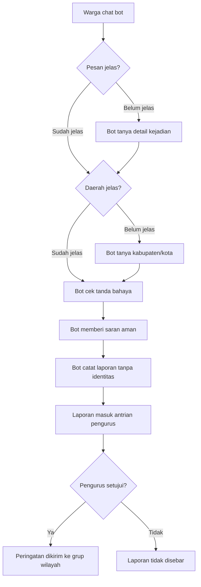

# Userflow Laporan Penipuan Warta Warga

Dokumen ini menjelaskan alur laporan dari sudut pandang warga. Bahasa dibuat sederhana agar mudah dipahami oleh pengguna, pengurus, atau pihak non-teknis.

## Ringkasan Singkat

Warga bisa melaporkan penipuan lewat WhatsApp. Bot akan membantu menanyakan detail yang penting, memastikan daerah kejadian jelas, menghapus data pribadi, lalu mencatat laporan untuk ditinjau pengurus.

Peringatan tidak langsung disebar otomatis. Pengurus mengecek dulu. Jika valid, peringatan dikirim ke grup warga di daerah yang sesuai.

## Tujuan Fitur

Fitur laporan dibuat supaya warga bisa:

- Melapor jika melihat atau mengalami penipuan.
- Mendapat arahan cepat agar tidak klik link, transfer uang, atau memberi OTP/PIN/NIK.
- Membantu warga lain di daerah yang sama supaya lebih waspada.
- Melapor tanpa menyebut identitas pribadi.

## Prinsip Utama

1. Warga tidak perlu menulis nama, nomor HP, NIK, atau alamat lengkap.
2. Bot hanya butuh cerita modus dan kabupaten/kota kejadian.
3. Laporan disimpan tanpa identitas pelapor.
4. Pengurus harus meninjau dulu sebelum peringatan disebar.
5. Peringatan yang disebar hanya berisi modus umum, bukan cerita pribadi warga.

## Userflow Utama



## Alur Dari Sudut Pandang Warga

### 1. Warga memulai laporan

Warga bisa mulai dengan memilih menu:

```text
3
```

Atau langsung menulis:

```text
Saya mau lapor penipuan.
```

Bot akan menjawab dengan ramah dan meminta cerita singkat.

Contoh balasan bot:

```text
Boleh, ceritakan kejadiannya ya.
Modus penipuannya gimana?

Misal: ada yang mengaku petugas, lalu minta transfer biaya pencairan bansos.

Tidak perlu sebut nama, nomor HP, NIK, atau alamat lengkap.
```

### 2. Warga menceritakan kejadian

Warga cukup menceritakan hal yang terjadi.

Contoh:

```text
Ada yang kirim WA ngaku dari Dinsos.
Katanya bansos cair, tapi saya diminta klik link dan isi NIK.
```

Atau:

```text
Ada orang ngaku petugas bank.
Dia minta kode OTP dan bilang rekening saya akan diblokir.
```

Bot akan melihat apakah cerita sudah cukup jelas.

Yang dianggap penting:

- Apakah ada yang minta transfer uang?
- Apakah ada yang minta pulsa?
- Apakah ada yang minta OTP, PIN, password, NIK, atau nomor rekening?
- Apakah ada link mencurigakan?
- Apakah ada file APK atau aplikasi yang diminta untuk di-install?
- Apakah pelaku mengaku sebagai petugas, bank, kurir, CS, RT/RW, Dinsos, atau instansi?

### 3. Jika cerita belum jelas, bot bertanya lagi

Kalau warga hanya menulis:

```text
Saya mau lapor.
```

Bot belum mencatat laporan. Bot akan bertanya dulu agar tidak salah paham.

Contoh:

```text
Boleh ceritakan sedikit?
Ada yang minta uang, OTP, klik link, atau mengaku petugas?
```

Jika warga masih bingung, bot akan membantu dengan pertanyaan sederhana.

Contoh:

```text
Singkat aja, ada salah satu ini nggak:
- minta uang atau transfer?
- minta OTP/PIN/data pribadi?
- ngajak klik link?
- mengaku petugas/bank/CS?
```

Jika warga tetap belum bisa menjelaskan, bot tidak memaksa. Warga bisa lapor lagi nanti.

### 4. Bot memastikan daerah kejadian

Laporan harus punya daerah yang jelas supaya peringatan tidak salah sasaran.

Jika laporan dikirim di grup daerah, bot memakai daerah grup tersebut.

Contoh:

```text
Grup: Warta Warga Kab. Banyumas
```

Maka laporan dianggap untuk Kabupaten Banyumas.

Jika laporan dikirim lewat chat pribadi dan belum menyebut daerah, bot akan bertanya:

```text
Biar peringatannya tepat sasaran, di daerah mana kejadiannya?
Sebut kabupaten/kota aja, misalnya "Kab. Banyumas".
```

Daerah yang terlalu luas belum cukup.

Contoh yang belum cukup:

```text
Jawa Barat
Indonesia
Jawa
```

Bot akan meminta kabupaten/kota.

Contoh yang cukup:

```text
Kab. Banyumas
Kota Semarang
Kab. Bekasi
```

### 5. Bot memberi penilaian awal

Setelah cerita dan daerah cukup jelas, bot memberi arahan cepat.

Jika berbahaya, bot akan menulis dengan jelas:

```text
🚨 INI PENIPUAN. Jangan dilanjutkan.
```

Lalu bot menjelaskan kenapa berbahaya dengan bahasa sederhana.

Contoh:

```text
Kenapa bahaya:
- Pelaku meminta data pribadi.
- Ada link yang belum jelas keamanannya.
- Modus seperti ini sering dipakai untuk mencuri uang atau data.
```

### 6. Bot memberi langkah aman

Bot tidak hanya mencatat laporan. Bot juga memberi saran yang bisa langsung dilakukan warga.

Contoh:

```text
Yang harus dilakukan sekarang:
1. Jangan klik link itu.
2. Jangan kirim OTP, PIN, password, NIK, atau uang.
3. Blokir pengirimnya.
4. Kalau sudah terlanjur klik atau kirim data, hubungi keluarga dan bank sekarang.
```

Jika warga sudah terlanjur transfer atau memberi OTP, bot akan mengarahkan ke bantuan nyata:

```text
Hubungi anak/keluarga sekarang.
Telepon bank di nomor resmi di belakang kartu ATM.
Jangan tunggu besok.
```

### 7. Bot mencatat laporan

Jika laporan sudah cukup jelas, bot mencatatnya.

Contoh konfirmasi:

```text
✅ Laporan Bapak/Ibu sudah saya catat untuk wilayah Kabupaten Banyumas.
Nanti ditinjau pengurus dulu sebelum peringatan disebar ke warga lain.
```

Yang dicatat bukan identitas pelapor.

Yang dicatat adalah:

- Modus penipuan.
- Daerah kabupaten/kota.
- Tingkat bahaya.
- Teks peringatan umum.
- Jumlah laporan serupa jika ada.

Contoh data yang dicatat:

```text
Modus: link palsu bansos yang meminta NIK dan OTP.
Wilayah: Kabupaten Banyumas.
Status: jelas penipuan.
```

Data seperti nama, nomor HP, NIK, alamat lengkap, atau nomor rekening akan disensor atau tidak disimpan.

### 8. Jika ada laporan serupa, sistem menggabungkan

Kalau ada warga lain melaporkan modus yang mirip di daerah yang sama, laporan tidak selalu dibuat sebagai kasus baru.

Sistem bisa menggabungkannya sebagai laporan serupa.

Contoh:

```text
3 laporan serupa diterima di Kabupaten Banyumas.
```

Ini membantu pengurus melihat mana modus yang sedang ramai.

Jika jumlah laporan serupa mencapai batas tertentu, pengurus akan diberi tanda bahwa laporan ini urgent untuk segera ditinjau.

Tetapi tetap tidak otomatis disebar. Pengurus tetap harus meninjau dulu.

### 9. Pengurus meninjau laporan

Setelah laporan dicatat, laporan masuk ke halaman pengurus.

Pengurus melihat:

- Daerah laporan.
- Modus yang dilaporkan.
- Jumlah laporan serupa.
- Alasan kenapa bot menilai ini mencurigakan.
- Teks peringatan yang akan disebar.

Pengurus bisa:

- Menyetujui dan menyebarkan peringatan.
- Mengedit teks peringatan dulu.
- Menolak laporan jika tidak valid.

### 10. Jika disetujui, peringatan dikirim

Jika pengurus menyetujui, peringatan dikirim ke grup warga di daerah yang sesuai.

Contoh isi peringatan:

```text
⚠️ Peringatan Dini Penipuan — Kabupaten Banyumas

Ada laporan link palsu bansos yang meminta data pribadi.
Jangan isi NIK, OTP, PIN, atau password di link yang tidak resmi.

Tips aman:
- Bansos resmi gratis.
- Jangan transfer uang atau pulsa.
- Cek hanya lewat cekbansos.kemensos.go.id atau tanya RT/pengurus.

Peringatan Warta Warga — disebar setelah ditinjau pengurus.
Identitas pelapor tidak disimpan.
```

### 11. Jika ditolak, laporan tidak disebar

Jika pengurus menilai laporan belum valid atau tidak layak disebar, laporan ditolak.

Warga lain tidak menerima peringatan dari laporan tersebut.

## Contoh Percakapan Lengkap

### Contoh 1: Laporan di grup daerah

```text
Warga:
3

Bot:
Silakan ceritakan penipuan yang ingin Bapak/Ibu laporkan di Kabupaten Banyumas.
Tidak perlu sebut nama, nomor HP, NIK, atau alamat lengkap.

Warga:
Ada WA ngaku dari Dinsos. Katanya bansos cair.
Tapi saya diminta klik link dan isi NIK sama OTP.

Bot:
🚨 INI PENIPUAN. Jangan dilanjutkan.

Kenapa bahaya:
- Ada link yang mencurigakan.
- Pelaku meminta NIK dan OTP.
- Data seperti itu bisa dipakai untuk mencuri akun atau uang.

Yang harus dilakukan sekarang:
1. Jangan klik link itu.
2. Jangan kirim OTP, PIN, password, NIK, atau uang.
3. Blokir pengirimnya.
4. Kalau sudah terlanjur klik, hubungi keluarga dan bank sekarang.

✅ Laporan Bapak/Ibu sudah saya catat untuk wilayah Kabupaten Banyumas.
Nanti ditinjau pengurus dulu sebelum peringatan disebar ke warga lain.
```

### Contoh 2: Laporan lewat chat pribadi

```text
Warga:
Saya mau lapor penipuan.

Bot:
Boleh, ceritakan kejadiannya ya.
Modus penipuannya gimana?
Tidak perlu sebut nama atau nomor siapa pun.

Warga:
Ada orang ngaku petugas bank. Dia minta OTP.

Bot:
Biar peringatannya tepat sasaran, di daerah mana kejadiannya?
Sebut kabupaten/kota aja, misalnya "Kab. Banyumas".

Warga:
Kota Semarang

Bot:
🚨 INI PENIPUAN. Jangan dilanjutkan.

Kenapa bahaya:
- OTP tidak boleh diberikan ke siapa pun.
- Pelaku mengaku petugas bank.

Yang harus dilakukan sekarang:
1. Jangan berikan OTP.
2. Blokir pengirim atau penelepon.
3. Kalau OTP sudah diberikan, segera hubungi bank.

✅ Laporan Bapak/Ibu sudah saya catat untuk wilayah Kota Semarang.
Nanti ditinjau pengurus dulu sebelum peringatan disebar ke warga lain.
```

## Hal yang Perlu Dipahami Warga

### Bot boleh mencatat laporan jika:

- Ada kejadian atau pesan mencurigakan yang nyata.
- Modusnya cukup jelas.
- Daerah kabupaten/kota jelas.
- Laporan tidak berisi fitnah personal.

### Bot belum mencatat laporan jika:

- Warga hanya berkata "mau lapor" tanpa cerita.
- Daerah belum jelas.
- Pesan hanya bertanya "ini asli atau palsu?" tanpa niat melapor.
- Isi laporan terlalu umum dan belum bisa dipahami.

### Bot tidak menyebarkan langsung karena:

- Laporan perlu dicek pengurus.
- Peringatan harus hati-hati agar tidak salah menuduh.
- Identitas warga harus tetap aman.
- Peringatan harus cocok dengan daerah yang benar.

## Pesan Utama Untuk User

Kalau ingin melapor, warga cukup mengirim:

```text
Saya mau lapor.
Modusnya: ...
Daerahnya: Kab/Kota ...
```

Contoh paling sederhana:

```text
Saya mau lapor. Ada yang mengaku petugas bansos di Kab. Banyumas.
Dia minta saya klik link dan isi NIK.
```

Warga tidak perlu menulis:

- Nama lengkap.
- Nomor HP.
- NIK.
- Alamat lengkap.
- Nomor rekening.
- Foto KTP.

## Versi Sangat Singkat

1. Warga cerita ada penipuan.
2. Bot tanya detail jika belum jelas.
3. Bot pastikan kabupaten/kota.
4. Bot memberi saran aman.
5. Bot mencatat laporan tanpa identitas.
6. Pengurus meninjau laporan.
7. Jika valid, peringatan disebar ke grup daerah.
8. Jika tidak valid, laporan tidak disebar.
